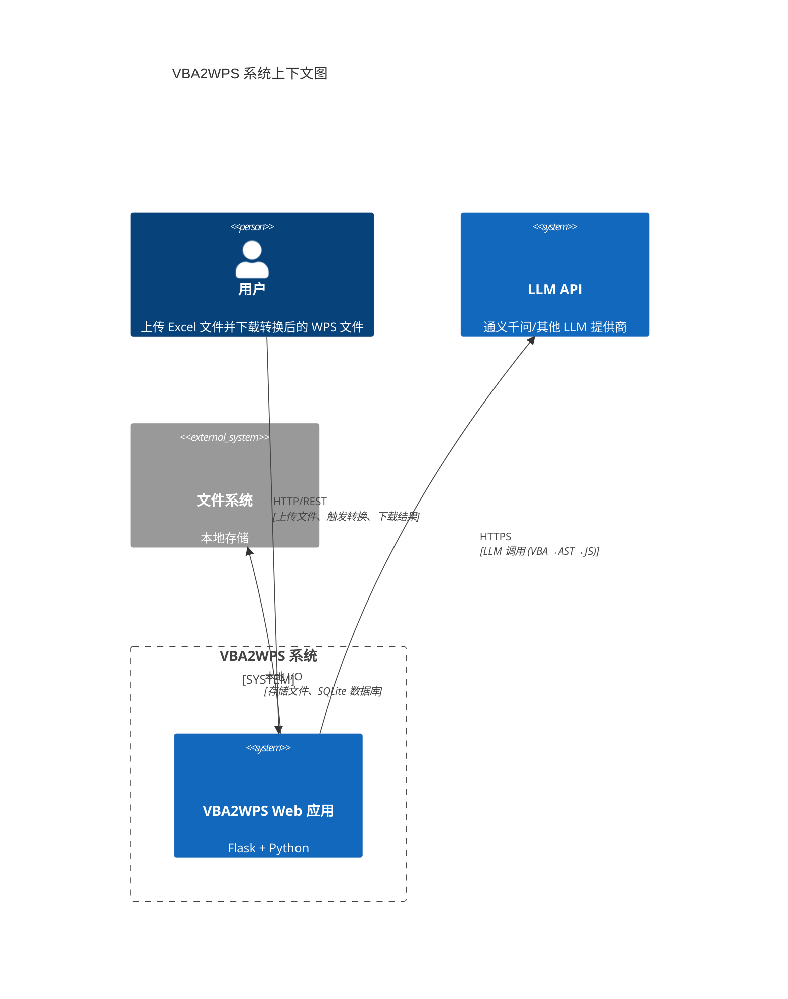
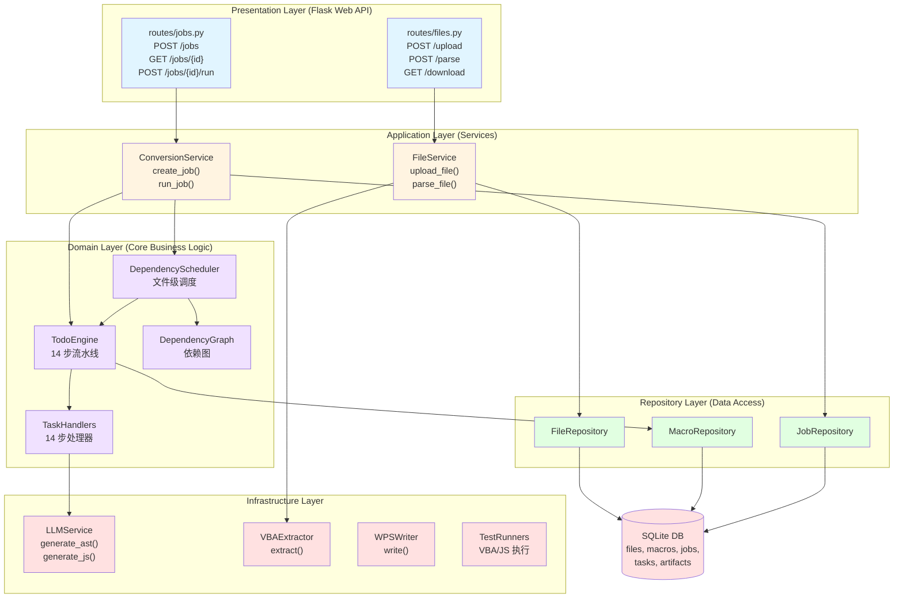
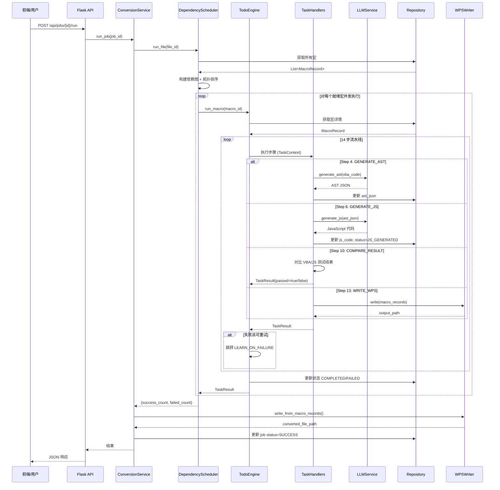
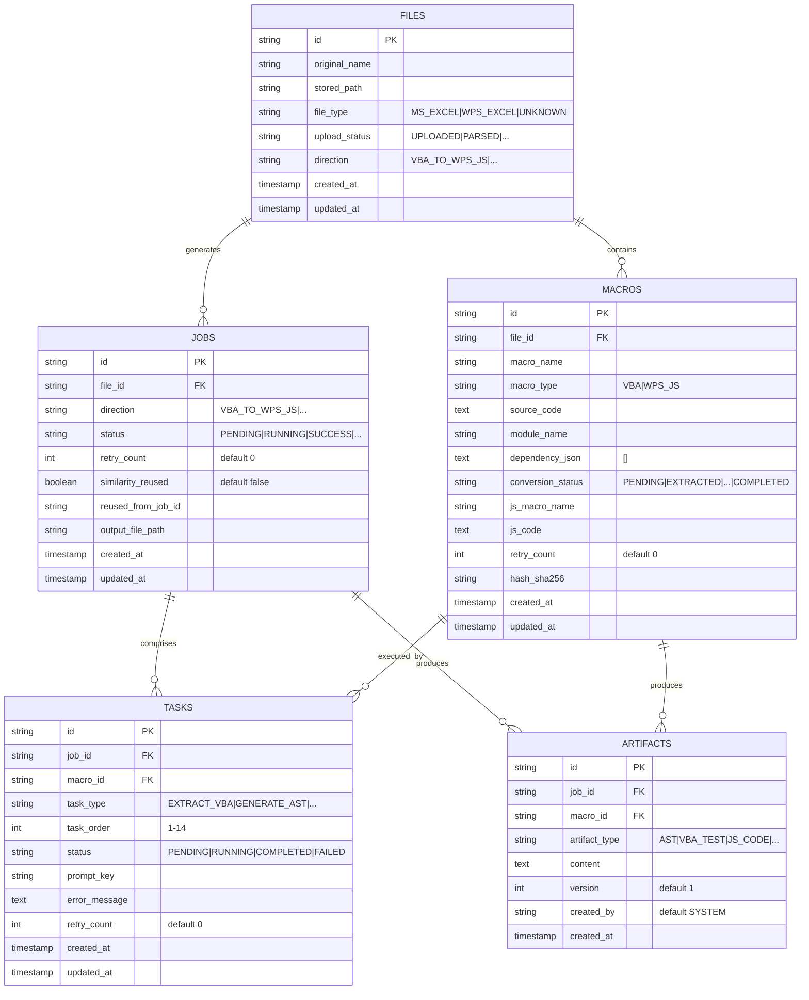
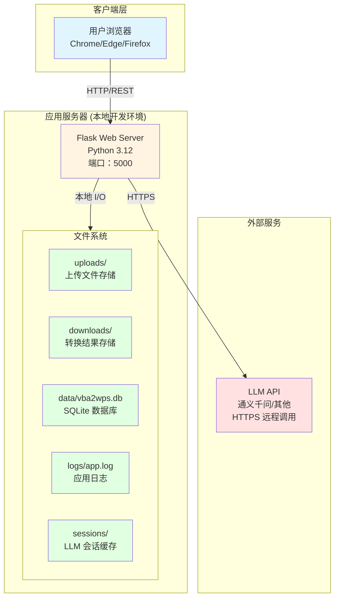

# VBA2WPS 架构提取报告

_生成时间：2026-03-12 · 证据来源：代码仓库分析_

---

## 证据收集清单

### 已分析文件

| 类别 | 文件 | 用途 |
|------|------|------|
| **入口** | `app.py` | Flask 应用入口 |
| **数据库** | `schema.sql` | SQLite DDL 定义 |
| **架构文档** | `ARCHITECTURE.md` | 现有架构说明 |
| **配置** | `config/settings.py`, `.env.example` | 应用配置 |
| **领域模型** | `domain/models/*.py` | 数据模型定义 |
| **领域服务** | `domain/services/*.py` | 核心业务逻辑 |
| **应用服务** | `application/services/*.py` | 应用层服务 |
| **Repository** | `repository/*.py` | 数据访问层 |
| **路由** | `presentation/routes/*.py` | API 路由 |
| **基础设施** | `integration/*.py` | 外部服务集成 |
| **LLM 模块** | `llm/**/*.py` | LLM 封装 |
| **前端** | `presentation/static/index.html` | Web UI |
| **依赖** | `requirements.txt` | Python 依赖 |

---

## 1. 系统上下文图

### 概要

描述 VBA2WPS 系统与外部参与者/系统的交互边界。

### 证据基础

- **证据 1**: `app.py` - Flask 应用监听 `:5000` 端口
- **证据 2**: `presentation/static/index.html` - 浏览器访问 `http://localhost:5000/`
- **证据 3**: `integration/llm_service.py` - 使用 `LiteLLMProvider` 调用 LLM API
- **证据 4**: `config/settings.py` - 配置 `LLM_API_KEY`, `LLM_MODEL` (默认 `qwen-plus`)
- **证据 5**: `repository/sqlite_db.py` - SQLite 数据库 `data/vba2wps.db`
- **证据 6**: `integration/parser/vba_extractor.py` - 使用 `oletools` 解析 Excel 文件
- **证据 7**: `integration/writer/wps_writer.py` - 写入 WPS 文件 (ZIP 格式)

### 置信度：**已确认**

### 图表

### 未知项/假设说明

| 项目 | 状态 | 说明 |
|------|------|------|
| LLM 提供商 | **已确认** | 代码支持多提供商 (LiteLLM)，默认使用 `qwen-plus` |
| 部署环境 | **未知** | 无 Dockerfile/K8s 配置，当前为本地开发环境 |
| 外部认证系统 | **无** | 未发现第三方认证集成 |

---

## 2. 模块架构图

### 概要

展示系统内部模块划分和依赖关系。

### 证据基础

- **证据 1**: 目录结构 - 清晰的分层架构 (`domain/`, `application/`, `presentation/`, `repository/`, `integration/`)
- **证据 2**: `app.py` - 导入语句显示模块依赖
- **证据 3**: `domain/services/__init__.py` - 导出 `TodoEngine`, `DependencyScheduler`, `TaskHandlers`
- **证据 4**: `presentation/routes/files.py`, `presentation/routes/jobs.py` - Flask Blueprint 路由分组
- **证据 5**: `integration/writer/wps_writer.py`, `integration/parser/vba_extractor.py` - 基础设施组件

### 置信度：**已确认**

### 图表

### 模块职责

| 模块 | 职责 | 关键文件 |
|------|------|---------|
| **Presentation** | HTTP API 接口，前端静态文件服务 | `routes/*.py`, `static/index.html` |
| **Application** | 应用服务，编排领域服务 | `FileService`, `ConversionService` |
| **Domain** | 核心业务逻辑，14 步转换流水线 | `TodoEngine`, `DependencyScheduler`, `TaskHandlers` |
| **Repository** | 数据访问，封装 SQLite 操作 | `*Repository` 类 |
| **Infrastructure** | 外部服务集成 (LLM、文件解析、WPS 写入) | `LLMService`, `VBAExtractor`, `WPSWriter` |

---

## 3. 核心业务流程图

### 概要

描述用户上传文件到下载转换结果的核心业务流程。

### 证据基础

- **证据 1**: `application/services/file_service.py` - `upload_file()`, `parse_file()` 方法
- **证据 2**: `application/services/conversion_service.py` - `create_job()`, `run_job()` 方法
- **证据 3**: `domain/services/dependency_scheduler.py` - `run_file()` 文件级调度
- **证据 4**: `domain/services/todo_engine.py` - `run_macro()` 宏级 14 步流水线
- **证据 5**: `integration/writer/wps_writer.py` - `write()` 写入 WPS 文件
- **证据 6**: `presentation/routes/*.py` - API 路由定义

### 置信度：**已确认**

### 图表

```mermaid
flowchart TD
    Start([用户上传 Excel 文件]) --> Upload["POST /api/files/upload<br/>FileService.upload_file()"]
    Upload --> StoreFile["存储文件到 uploads/<br/>创建 FileRecord"]
    StoreFile --> Parse["POST /api/files/{id}/parse<br/>FileService.parse_file()"]
    Parse --> ExtractMacros["VBAExtractor.extract()<br/>使用 oletools 提取 VBA 宏"]
    ExtractMacros --> SaveMacros["创建 MacroRecord<br/>状态：EXTRACTED"]
    SaveMacros --> CreateJob["POST /api/jobs<br/>ConversionService.create_job()"]
    CreateJob --> CreateJobRecord["创建 ConversionJob<br/>状态：PENDING"]
    CreateJobRecord --> RunJob["POST /api/jobs/{id}/run<br/>ConversionService.run_job()"]
    RunJob --> BuildGraph["DependencyScheduler.run_file()<br/>1. 获取所有宏<br/>2. 构建 DependencyGraph<br/>3. 拓扑排序检测环"]
    BuildGraph --> ScheduleLoop{"调度循环"}
    ScheduleLoop --> FindReady["查找就绪宏<br/>(依赖已满足)"]
    FindReady --> RunMacro["TodoEngine.run_macro()<br/>执行 14 步流水线"]
    RunMacro --> UpdateStatus["更新宏状态"]
    UpdateStatus --> CheckAll{"所有宏完成？"}
    CheckAll -->|否 | ScheduleLoop
    CheckAll -->|是 | WriteWPS["WPSWriter.write()<br/>注入 JS 宏到 WPS 文件"]
    WriteWPS --> SaveOutput["保存转换后文件到 downloads/"]
    SaveOutput --> UpdateJob["更新 Job 状态<br/>SUCCESS/PARTIAL_SUCCESS/FAILED"]
    UpdateJob --> Download["GET /api/files/{id}/download-converted<br/>下载转换后的文件"]
    Download --> End([流程结束])

    classDef userAction fill:#e1f5ff
    classDef systemAction fill:#fff4e1
    classDef decision fill:#f0e1ff
    classDef data fill:#e1ffe1

    class Start,Upload,Parse,CreateJob,RunJob,Download userAction
    class StoreFile,SaveMacros,CreateJobRecord,BuildGraph,RunMacro,UpdateStatus,WriteWPS,SaveOutput,UpdateJob systemAction
    class CheckAll,ScheduleLoop decision
    class ExtractMacros,FindReady,End data
```

### 流程说明

| 步骤 | 操作 | API/方法 | 状态变化 |
|------|------|---------|---------|
| 1 | 上传文件 | `POST /api/files/upload` | `FileRecord` 创建，状态 `UPLOADED` |
| 2 | 解析宏 | `POST /api/files/{id}/parse` | `MacroRecord` 创建，状态 `EXTRACTED` |
| 3 | 创建任务 | `POST /api/jobs` | `ConversionJob` 创建，状态 `PENDING` |
| 4 | 执行转换 | `POST /api/jobs/{id}/run` | Job 状态 → `RUNNING` |
| 5 | 依赖调度 | `DependencyScheduler.run_file()` | 构建依赖图，拓扑排序 |
| 6 | 宏转换 | `TodoEngine.run_macro()` | 执行 14 步流水线 |
| 7 | 写入 WPS | `WPSWriter.write()` | 宏状态 → `WRITTEN_TO_WPS` |
| 8 | 下载结果 | `GET /api/files/{id}/download-converted` | Job 状态 → `SUCCESS` |

---

## 4. 核心序列图

### 概要

描述单个宏转换的 14 步流水线运行时交互。

### 证据基础

- **证据 1**: `domain/services/todo_engine.py` - `run_macro()` 方法，14 步定义 `TODO_STEPS`
- **证据 2**: `domain/services/task_handlers.py` - 14 个处理器方法
- **证据 3**: `integration/llm_service.py` - `generate_ast()`, `generate_js()` LLM 调用
- **证据 4**: `domain/models/macro_record.py` - `ConversionStatus` 枚举定义状态转换
- **证据 5**: `config/prompts.yaml` - LLM Prompt 模板配置

### 置信度：**已确认**

### 图表

### 14 步流水线详情

| 步骤 | 处理器 | 输入 | 输出 | LLM 调用 |
|------|--------|------|------|---------|
| 1. EXTRACT_VBA | `extract_vba()` | 文件路径 | VBA 代码 | 无 |
| 2. FIND_SIMILAR | `find_similar()` | VBA 代码 | 相似历史记录 | 无 |
| 3. REUSE_OR_CONTINUE | `reuse_or_continue()` | 相似度 | 复用？ | 无 |
| 4. GENERATE_AST | `generate_ast()` | VBA 代码 | AST JSON | ✅ |
| 5. GENERATE_VBA_TEST | `generate_vba_test()` | VBA 代码 | VBA 测试用例 | ✅ |
| 6. GENERATE_JS | `generate_js()` | AST JSON | JavaScript 代码 | ✅ |
| 7. GENERATE_JS_TEST | `generate_js_test()` | JS 代码 | JS 测试用例 | ✅ |
| 8. RUN_VBA_TEST | `run_vba_test()` | VBA 测试 | 测试结果 | 无 |
| 9. RUN_JS_TEST | `run_js_test()` | JS 测试 | 测试结果 | 无 |
| 10. COMPARE_RESULT | `compare_result()` | VBA/JS 结果 | 对比报告 | 无 |
| 11. LEARN_ON_FAILURE | `learn_on_failure()` | 失败信息 | Learning 规则 | ✅ |
| 12. RETRY_CONVERSION | `retry_conversion()` | Learning 规则 | 重试？ | 无 |
| 13. WRITE_WPS | `write_wps()` | JS 代码 | WPS 文件路径 | 无 |
| 14. FINALIZE | `finalize()` | 最终状态 | COMPLETED/FAILED | 无 |

---

## 5. 核心 ER 图

### 概要

描述数据库表结构和关系。

### 证据基础

- **证据 1**: `schema.sql` - SQLite DDL 定义 (5 张表)
- **证据 2**: `domain/models/*.py` - 数据模型类定义
- **证据 3**: `repository/*.py` - Repository 实现，显示表字段使用

### 置信度：**已确认**

### 图表

### 表说明

| 表名 | 用途 | 关键字段 | 索引 |
|------|------|---------|------|
| **files** | 存储上传文件元数据 | `id`, `original_name`, `stored_path`, `upload_status` | - |
| **macros** | 存储 VBA/JS 宏记录 | `file_id`, `macro_name`, `source_code`, `js_code`, `conversion_status` | `idx_macros_file_id` |
| **jobs** | 存储转换任务 | `file_id`, `direction`, `status`, `output_file_path` | - |
| **tasks** | 存储 14 步流水线执行记录 | `job_id`, `macro_id`, `task_type`, `task_order`, `status` | `idx_tasks_job_id`, `idx_tasks_macro_id` |
| **artifacts** | 存储转换产物 (AST、测试用例等) | `job_id`, `macro_id`, `artifact_type`, `content` | `idx_artifacts_job_id` |

### 约束

- `MACROS(file_id, macro_name)` - **UNIQUE** 约束，防止同一文件重复宏
- 所有外键关联到父表 `id` 字段
- 时间戳默认 `CURRENT_TIMESTAMP`

---

## 6. 部署图

### 概要

描述系统运行时部署拓扑。

### 证据基础

- **证据 1**: `app.py` - `app.run(debug=True, host='0.0.0.0', port=5000)`
- **证据 2**: `config/settings.py` - 路径配置 `UPLOAD_DIR`, `DOWNLOAD_DIR`, `DB_PATH`
- **证据 3**: `presentation/static/index.html` - 单页应用，直接由 Flask 服务
- **证据 4**: `requirements.txt` - Python 依赖，无 Docker/容器化配置
- **证据 5**: `.env.example` - 环境变量配置

### 置信度：**已确认** (局部视图 - 开发环境)

### 图表

### 部署节点说明

| 节点 | 类型 | 配置 | 证据 |
|------|------|------|------|
| **Flask Web Server** | 应用服务器 | Python 3.12, Flask 3.0, 端口 5000 | `app.py`, `requirements.txt` |
| **uploads/** | 文件存储 | 本地目录，存储上传的 Excel 文件 | `config/settings.py` |
| **downloads/** | 文件存储 | 本地目录，存储转换后的 WPS 文件 | `config/settings.py` |
| **data/vba2wps.db** | 数据库 | SQLite 单文件数据库 | `schema.sql`, `repository/sqlite_db.py` |
| **logs/app.log** | 日志 | RotatingFileHandler, 10MB 限制 | `app.py` |
| **sessions/** | 会话缓存 | JSON 文件，存储 LLM 会话上下文 | 目录存在 |
| **LLM API** | 外部服务 | 远程 HTTPS API (默认 `qwen-plus`) | `integration/llm_service.py` |

### 未知项/假设说明

| 项目 | 状态 | 说明 |
|------|------|------|
| **生产部署** | ❌ 未知 | 无 Dockerfile、docker-compose、K8s 配置 |
| **负载均衡** | ❌ 无 | 单 Flask 实例，无 Nginx/HAProxy 配置 |
| **缓存层** | ❌ 无 | 无 Redis/Memcached 配置 |
| **消息队列** | ❌ 无 | 无 RabbitMQ/Kafka 配置 |
| **监控** | ❌ 未知 | 无 Prometheus/Grafana 配置 |
| **CI/CD** | ❌ 未知 | 无 GitHub Actions/Jenkins 配置 |

---

## 附录：关键设计决策

### A.1 分层架构选择

**决策**: 采用经典分层架构 (Presentation → Application → Domain → Repository → Infrastructure)

**证据**: 
- 目录结构清晰分离各层职责
- `ARCHITECTURE.md` 明确说明分层设计
- 导入语句显示单向依赖 (上层依赖下层)

**优点**:
- 职责分离，易于维护
- 领域逻辑不依赖基础设施
- 易于单元测试

### A.2 14 步流水线设计

**决策**: 宏转换采用 14 步固定流水线，支持步骤跳转和重试

**证据**:
- `domain/services/todo_engine.py` - `TODO_STEPS` 列表定义 14 步
- `domain/services/task_handlers.py` - 14 个处理器实现
- `domain/services/task_result.py` - `jump_to_step` 支持流程跳转

**优点**:
- 每步职责单一，易于理解和调试
- 支持 Learning 规则注入和自动重试
- 可灵活跳过或重试特定步骤

### A.3 依赖调度策略

**决策**: 文件级依赖调度 + 宏级流水线执行

**证据**:
- `domain/services/dependency_scheduler.py` - `run_file()` 构建依赖图
- `domain/services/dependency_graph.py` - 拓扑排序检测环
- `domain/services/todo_engine.py` - `run_macro()` 执行单个宏转换

**优点**:
- 正确处理宏之间的依赖关系
- 并发执行无依赖的宏 (信号量控制最多 3 个并发)
- 避免死锁和循环依赖

### A.4 SQLite 数据库选择

**决策**: 使用 SQLite 单文件数据库

**证据**:
- `schema.sql` - SQLite DDL
- `repository/sqlite_db.py` - `sqlite3.connect()`
- 无其他数据库配置

**优点**:
- 零配置，开箱即用
- 适合本地开发和中小规模数据
- 单文件便于备份和迁移

---

## 质量评估

### 证据覆盖率

| 视图 | 证据充分度 | 置信度 |
|------|-----------|--------|
| 系统上下文图 | ✅ 充分 | **已确认** |
| 模块架构图 | ✅ 充分 | **已确认** |
| 核心业务流程图 | ✅ 充分 | **已确认** |
| 核心序列图 | ✅ 充分 | **已确认** |
| 核心 ER 图 | ✅ 充分 | **已确认** |
| 部署图 | ⚠️ 局部 (仅开发环境) | **已确认 (局部)** |

### 未知项汇总

| 类别 | 未知项 | 影响 |
|------|--------|------|
| **部署** | 生产环境配置、容器化、CI/CD | 无法评估生产就绪性 |
| **安全** | 认证、授权、加密、审计 | 安全策略未知 |
| **性能** | 并发用户数、QPS、响应时间 SLA | 性能容量未知 |
| **监控** | 日志聚合、指标收集、告警 | 运维可见性未知 |

### 架构一致性检查

- ✅ **代码与文档一致**: `ARCHITECTURE.md` 描述与实际代码结构匹配
- ✅ **模型与数据库一致**: `domain/models/*.py` 与 `schema.sql` 字段一致
- ✅ **API 与实现一致**: 路由定义与服务方法调用一致
- ⚠️ **部分功能 MVP 简化**: 测试执行、Learning 规则等模块为占位实现

---

_报告生成完成 · 基于代码仓库 vba2wps 分析 · 2026-03-12_
