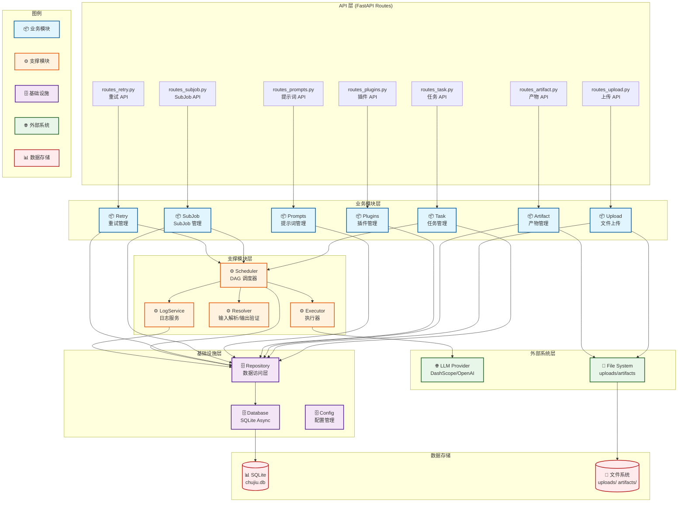

# Chujiu Project 模块架构分析报告

**分析时间**: 2026-03-17  
**分析版本**: v1.0  
**项目版本**: 2.0.0 (FastAPI)

---

## A. 项目架构类型判断

### 判断结果
**单体应用（Monolithic Application）带逻辑模块划分**

### 判断依据
1. **单一代码库**: 所有代码在 `chujiu_project/` 单一目录下
2. **单一部署单元**: 通过 `run.py` 启动单个 FastAPI 应用
3. **共享数据库**: 所有模块共享 SQLite 数据库（`chujiu.db`）
4. **逻辑模块划分**: 按业务能力在 `app/` 目录下划分逻辑模块
5. **进程内调用**: 模块间通过 Python 函数/类直接调用，无网络通信

---

## B. 模块清单

### B1. 业务模块

#### 1. 任务管理模块 (Task Management)

| 属性 | 值 |
|------|-----|
| **模块名** | `task` |
| **类型** | 业务模块 |
| **主要职责** | 任务创建、任务执行、任务状态管理、任务查询 |
| **代码证据** | `app/routes/routes_task.py`, `app/models.py:TaskRun/TaskTemplate`, `app/repository/task_repository.py` |
| **核心入口** | `POST /api/tasks/task-runs`, `GET /api/tasks/task-runs/{id}`, `POST /api/tasks/task-runs/{id}/start` |
| **主要依赖** | scheduler 模块、repository 层、upload 模块 |
| **数据归属** | `task_run`, `task_template` 表 |

#### 2. 文件上传模块 (File Upload)

| 属性 | 值 |
|------|-----|
| **模块名** | `upload` |
| **类型** | 业务模块 |
| **主要职责** | 文件上传、文件存储、文件元数据管理、文件校验 |
| **代码证据** | `app/routes/routes_upload.py`, `app/models.py:UploadFile`, `app/repository/upload_repository.py` |
| **核心入口** | `POST /api/uploads`, `GET /api/uploads/{id}` |
| **主要依赖** | repository 层、文件系统 |
| **数据归属** | `upload_file` 表 |

#### 3. 产物管理模块 (Artifact Management)

| 属性 | 值 |
|------|-----|
| **模块名** | `artifact` |
| **类型** | 业务模块 |
| **主要职责** | 产物生成、产物存储、产物下载 |
| **代码证据** | `app/routes/routes_artifact.py`, `app/models.py:Artifact` |
| **核心入口** | `GET /api/artifacts`, `GET /api/artifacts/{id}/download` |
| **主要依赖** | repository 层、文件系统 |
| **数据归属** | `artifact` 表 |

#### 4. 插件管理模块 (Plugin Management)

| 属性 | 值 |
|------|-----|
| **模块名** | `plugins` |
| **类型** | 业务模块 + 支撑模块 |
| **主要职责** | 插件注册、插件发现、插件启用/禁用、插件 DAG 配置加载 |
| **代码证据** | `app/plugins/plugin_registry.py`, `app/routes/routes_plugins.py`, `app/plugins/*/config.py` |
| **核心入口** | `GET /api/plugins`, `PUT /api/plugins/{code}/toggle`, `GET /api/plugins/{code}/dag` |
| **主要依赖** | 文件系统（插件目录）、importlib（动态导入） |
| **数据归属** | 插件配置（JSON 文件） |

#### 5. 提示词管理模块 (Prompt Management)

| 属性 | 值 |
|------|-----|
| **模块名** | `prompts` |
| **类型** | 业务模块 |
| **主要职责** | 提示词模板管理、提示词版本控制 |
| **代码证据** | `app/routes/routes_prompts.py`, `app/models/prompts.py` |
| **核心入口** | `GET /api/prompts`, `POST /api/prompts`, `PUT /api/prompts/{id}` |
| **主要依赖** | repository 层 |
| **数据归属** | `prompt` 表 |

#### 6. SubJob 管理模块 (SubJob Management)

| 属性 | 值 |
|------|-----|
| **模块名** | `subjob` |
| **类型** | 业务模块 |
| **主要职责** | SubJob 创建、SubJob 执行、SubJob 与主 Job 协调 |
| **代码证据** | `app/routes/routes_subjob.py`, `app/models.py:JobRun` |
| **核心入口** | `POST /api/subjobs`, `POST /api/subjobs/{id}/complete` |
| **主要依赖** | scheduler 模块、repository 层 |
| **数据归属** | `job_run` 表 |

#### 7. 重试管理模块 (Retry Management)

| 属性 | 值 |
|------|-----|
| **模块名** | `retry` |
| **类型** | 业务模块 |
| **主要职责** | 失败节点重试、批量重试、重试策略管理 |
| **代码证据** | `app/routes/routes_retry.py`, `app/scheduler/recovery_service.py` |
| **核心入口** | `POST /api/retry/nodes/{id}`, `POST /api/retry/jobs/{id}/all` |
| **主要依赖** | scheduler 模块、repository 层 |
| **数据归属** | `node_run`, `execution_log` 表 |

---

### B2. 平台/支撑模块

#### 8. DAG 调度器模块 (DAG Scheduler)

| 属性 | 值 |
|------|-----|
| **模块名** | `scheduler` |
| **类型** | 支撑模块 |
| **主要职责** | DAG 解析、DAG 验证、节点调度、节点执行、状态管理、重试策略 |
| **代码证据** | `app/scheduler/dag_scheduler.py`, `app/scheduler/task_scheduler.py`, `app/scheduler/recovery_service.py` |
| **核心入口** | `DagScheduler.run()`, `TaskScheduler.execute_task()` |
| **主要依赖** | executor 层、resolver 层、repository 层 |
| **数据归属** | 无（操作业务模块数据） |

#### 9. 执行器模块 (Executor)

| 属性 | 值 |
|------|-----|
| **模块名** | `executor` |
| **类型** | 支撑模块 |
| **主要职责** | Python 代码执行、LLM 调用、文件操作、Todolist 执行 |
| **代码证据** | `app/scheduler/executors/*.py` |
| **核心入口** | `PythonExecutor.execute()`, `LLMExecutor.execute()`, `FileExecutor.execute()` |
| **主要依赖** | providers 模块（LLM）、文件系统 |
| **数据归属** | 无 |

#### 10. 输入解析与输出验证模块 (Resolver)

| 属性 | 值 |
|------|-----|
| **模块名** | `resolver` |
| **类型** | 支撑模块 |
| **主要职责** | 输入映射解析、输出 Schema 验证 |
| **代码证据** | `app/scheduler/resolver/input_resolver.py`, `app/scheduler/resolver/output_validator.py` |
| **核心入口** | `InputResolver.resolve()`, `OutputValidator.validate()` |
| **主要依赖** | 无 |
| **数据归属** | 无 |

#### 11. 日志服务模块 (Log Service)

| 属性 | 值 |
|------|-----|
| **模块名** | `log_service` |
| **类型** | 支撑模块 |
| **主要职责** | 执行日志记录、日志持久化 |
| **代码证据** | `app/scheduler/log_service.py` |
| **核心入口** | `LogService.log()` |
| **主要依赖** | repository 层 |
| **数据归属** | `execution_log` 表 |

---

### B3. 基础设施模块

#### 12. 数据库模块 (Database)

| 属性 | 值 |
|------|-----|
| **模块名** | `database` |
| **类型** | 基础设施模块 |
| **主要职责** | 数据库连接管理、Session 工厂、依赖注入 |
| **代码证据** | `app/database.py` |
| **核心入口** | `get_db()`, `init_db()`, `close_db()` |
| **主要依赖** | SQLAlchemy Async, aiosqlite |
| **数据归属** | SQLite 数据库 |

#### 13. Repository 层 (Data Access)

| 属性 | 值 |
|------|-----|
| **模块名** | `repository` |
| **类型** | 基础设施模块 |
| **主要职责** | 数据访问封装、CRUD 操作 |
| **代码证据** | `app/repository/*.py` |
| **核心入口** | `task_run_repository.*`, `upload_file_repository.*` |
| **主要依赖** | database 模块、models |
| **数据归属** | 各业务表 |

#### 14. 配置模块 (Config)

| 属性 | 值 |
|------|-----|
| **模块名** | `config` |
| **类型** | 基础设施模块 |
| **主要职责** | 应用配置加载、配置验证 |
| **代码证据** | `app/config/schema.py`, `app/config/loader.py` |
| **核心入口** | `load_config()`, `save_config()` |
| **主要依赖** | pydantic-settings |
| **数据归属** | 配置文件（.env） |

---

### B4. 公共库/工具模块

#### 15. 工具模块 (Utils)

| 属性 | 值 |
|------|-----|
| **模块名** | `utils` |
| **类型** | 公共模块 |
| **主要职责** | 通用工具函数、响应格式化 |
| **代码证据** | `app/utils/helpers.py`, `app/utils/response.py` |
| **核心入口** | `success_response()`, `error_response()` |
| **主要依赖** | 无 |
| **数据归属** | 无 |

#### 16. 数据模型模块 (Models)

| 属性 | 值 |
|------|-----|
| **模块名** | `models` |
| **类型** | 公共模块 |
| **主要职责** | SQLAlchemy 数据模型定义 |
| **代码证据** | `app/models.py`, `app/models/prompts.py` |
| **核心入口** | `User`, `UploadFile`, `TaskRun`, `JobRun`, `NodeRun`, `Artifact` |
| **主要依赖** | SQLAlchemy |
| **数据归属** | 各表定义 |

#### 17. Schema 模块 (Schemas)

| 属性 | 值 |
|------|-----|
| **模块名** | `schemas` |
| **类型** | 公共模块 |
| **主要职责** | Pydantic 数据验证 Schema |
| **代码证据** | `app/schemas/*.py` |
| **核心入口** | `TaskCreate`, `TaskResponse`, `UploadResponse` |
| **主要依赖** | pydantic |
| **数据归属** | 无 |

---

### B5. 外部系统适配模块

#### 18. LLM Provider 模块 (Providers)

| 属性 | 值 |
|------|-----|
| **模块名** | `providers` |
| **类型** | 外部系统适配模块 |
| **主要职责** | LLM 服务抽象、多 Provider 支持 |
| **代码证据** | `app/providers/base.py`, `app/providers/litellm_provider.py` |
| **核心入口** | `LLMProvider.chat()`, `LiteLLMProvider.chat()` |
| **主要依赖** | litellm 库、外部 LLM API（DashScope/OpenAI） |
| **数据归属** | 无 |

#### 19. 定时任务模块 (Cron)

| 属性 | 值 |
|------|-----|
| **模块名** | `cron` |
| **类型** | 外部系统适配模块 |
| **主要职责** | 定时任务调度、Cron 表达式解析 |
| **代码证据** | `app/cron/service.py`, `app/cron/task_execution.py` |
| **核心入口** | `CronService.schedule_task()` |
| **主要依赖** | scheduler 模块 |
| **数据归属** | 无 |

#### 20. 心跳模块 (Heartbeat)

| 属性 | 值 |
|------|-----|
| **模块名** | `heartbeat` |
| **类型** | 外部系统适配模块 |
| **主要职责** | 心跳检测、任务状态查询 |
| **代码证据** | `app/heartbeat/service.py`, `app/heartbeat/task_query.py` |
| **核心入口** | `HeartbeatService.check()`, `TaskQuery.query_tasks()` |
| **主要依赖** | repository 层 |
| **数据归属** | 无 |

---

## C. 模块关系总结

### C1. 主要同步调用关系

```
┌─────────────┐     ┌─────────────┐     ┌─────────────┐
│   Routes    │────▶│  Scheduler  │────▶│  Executor   │
│  (API 层)    │     │  (调度层)   │     │  (执行层)   │
└─────────────┘     └─────────────┘     └─────────────┘
       │                   │                   │
       ▼                   ▼                   ▼
┌─────────────┐     ┌─────────────┐     ┌─────────────┐
│ Repository  │◀────│  Resolver   │     │  Providers  │
│  (数据层)   │     │  (解析层)   │     │  (外部适配) │
└─────────────┘     └─────────────┘     └─────────────┘
       │
       ▼
┌─────────────┐
│  Database   │
│  (SQLite)   │
└─────────────┘
```

**调用链示例**:
1. **任务创建**: `routes_task.py` → `task_repository.py` → `database.py` → SQLite
2. **任务执行**: `routes_task.py` → `task_scheduler.py` → `dag_scheduler.py` → `executor` → `providers` → 外部 LLM
3. **文件上传**: `routes_upload.py` → `upload_repository.py` → `database.py` → SQLite + 文件系统

---

### C2. 主要异步事件关系

| 事件类型 | 生产者 | 消费者 | 说明 |
|---------|--------|--------|------|
| 任务创建完成 | `routes_task.py` | `BackgroundTasks` | 后台执行任务 |
| 节点执行完成 | `dag_scheduler.py` | `recovery_service.py` | 触发恢复逻辑 |
| 定时任务触发 | `cron/service.py` | `task_scheduler.py` | 定时执行任务 |
| 心跳检测 | `heartbeat/service.py` | `task_query.py` | 查询待执行任务 |

---

### C3. 数据存储与中间件关系

| 存储类型 | 模块 | 说明 |
|---------|------|------|
| **SQLite** | `database.py` | 主数据库，存储所有业务数据 |
| **文件系统** | `uploads/`, `artifacts/` | 存储上传文件和生成产物 |
| **内存缓存** | `PluginRegistry` | 插件注册表（单例） |
| **环境变量** | `.env` | 应用配置 |

---

### C4. 外部系统依赖关系

| 外部系统 | 适配模块 | 调用方式 | 说明 |
|---------|---------|---------|------|
| **LLM API** | `providers/litellm_provider.py` | HTTP/RPC | DashScope/OpenAI 等 |
| **文件系统** | `routes_upload.py`, `executor/file_executor.py` | 本地 IO | 上传文件、产物存储 |

---

## D. 风险点与不确定项

### D1. 边界不清晰处

1. **scheduler 与 executor 边界**
   - 问题：executor 内部调用 providers，职责有重叠
   - 建议：明确 executor 只负责执行，providers 负责外部调用

2. **plugins 模块定位**
   - 问题：既是业务模块（插件管理）又是支撑模块（插件注册）
   - 建议：拆分为 `plugin_management`（业务）和 `plugin_registry`（支撑）

### D2. 高耦合处

1. **scheduler 模块**
   - 耦合度：高
   - 原因：依赖 repository、executor、resolver、log_service 等多个模块
   - 建议：通过接口抽象降低耦合

2. **routes_task.py**
   - 耦合度：高
   - 原因：直接调用 scheduler、repository、upload 等多个模块
   - 建议：引入 service 层封装业务逻辑

### D3. 共享数据问题

1. **SQLite 单数据库**
   - 风险：所有模块共享同一数据库，存在锁竞争
   - 建议：生产环境考虑迁移到 PostgreSQL/MySQL

2. **文件系统共享**
   - 风险：uploads/和 artifacts/目录可能被并发访问
   - 建议：增加文件锁或对象存储

### D4. 证据不足项

1. **todolist 模块**
   - 状态：不确定
   - 原因：目录存在但代码证据不足
   - 待确认：todolist 具体职责和使用场景

2. **agent 模块**
   - 状态：不确定
   - 原因：目录存在但代码证据不足
   - 待确认：agent 模块是否在使用中

---

## E. 架构图

### E1. 高层模块架构说明

```
┌─────────────────────────────────────────────────────────────┐
│                      API Gateway Layer                       │
│                    (FastAPI Routes)                          │
└─────────────────────────────────────────────────────────────┘
                              │
        ┌─────────────────────┼─────────────────────┐
        │                     │                     │
        ▼                     ▼                     ▼
┌───────────────┐   ┌───────────────┐   ┌───────────────┐
│  业务模块层    │   │  支撑模块层    │   │  基础设施层    │
│  Task/Upload  │   │  Scheduler    │   │  Database     │
│  Plugin/Prompt│   │  Executor     │   │  Repository   │
│  SubJob/Retry │   │  Resolver     │   │  Config       │
└───────────────┘   └───────────────┘   └───────────────┘
        │                     │                     │
        └─────────────────────┼─────────────────────┘
                              │
                              ▼
                    ┌───────────────┐
                    │   数据存储层   │
                    │  SQLite + FS  │
                    └───────────────┘
```

### E2. Mermaid 模块架构图



---

## F. 模块复杂度统计

| 模块类型 | 模块数 | 代码行数估算 | 复杂度 |
|---------|--------|------------|--------|
| 业务模块 | 7 | ~5000 行 | 中 |
| 支撑模块 | 4 | ~3000 行 | 高 |
| 基础设施 | 3 | ~1500 行 | 低 |
| 公共模块 | 3 | ~1000 行 | 低 |
| 外部适配 | 3 | ~1000 行 | 中 |
| **总计** | **20** | **~11500 行** | **中** |

---

**报告生成时间**: 2026-03-17  
**分析基于版本**: FastAPI v2.0.0  
**下次审查**: 2026-04-17
