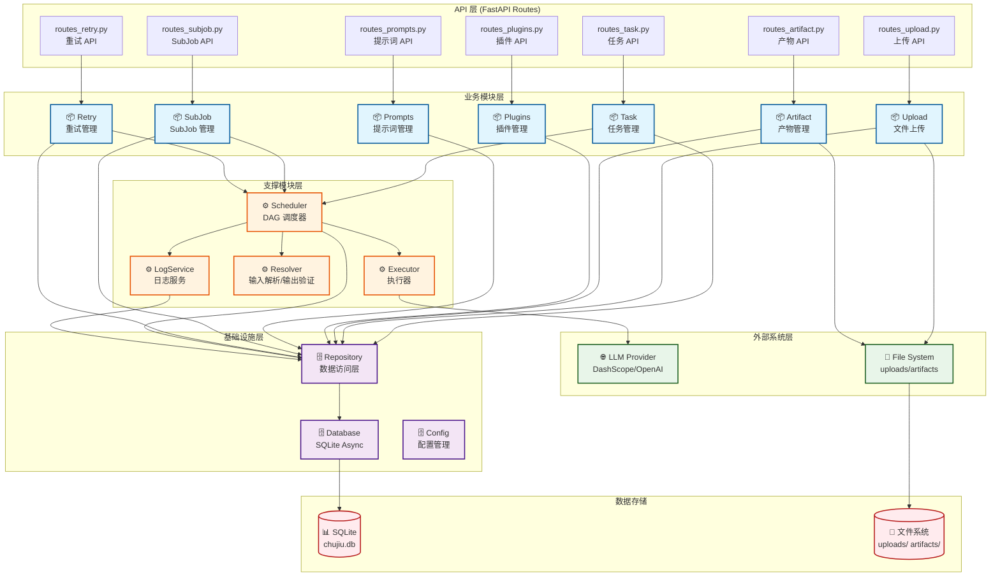

# Chujiu Project 模块架构图

**项目**: Chujiu TodoList Application  
**版本**: 2.0.0 (FastAPI)  
**分析时间**: 2026-03-17

---

## 高层模块架构

```
┌─────────────────────────────────────────────────────────────┐
│                      API Gateway Layer                       │
│                    (FastAPI Routes)                          │
│  /api/tasks | /api/uploads | /api/artifacts | /api/plugins  │
└─────────────────────────────────────────────────────────────┘
                              │
        ┌─────────────────────┼─────────────────────┐
        │                     │                     │
        ▼                     ▼                     ▼
┌───────────────┐   ┌───────────────┐   ┌───────────────┐
│  业务模块层    │   │  支撑模块层    │   │  基础设施层    │
│  Task/Upload  │   │  Scheduler    │   │  Database     │
│  Plugin/Prompt│   │  Executor     │   │  Repository   │
│  SubJob/Retry │   │  Resolver     │   │  Config       │
└───────────────┘   └───────────────┘   └───────────────┘
        │                     │                     │
        └─────────────────────┼─────────────────────┘
                              │
                              ▼
                    ┌───────────────┐
                    │   数据存储层   │
                    │  SQLite + FS  │
                    └───────────────┘
```

---

## Mermaid 模块架构图



---

## 模块职责说明

### 业务模块（7 个）

| 模块 | 职责 | 核心 API |
|------|------|---------|
| **Task** | 任务创建、执行、状态管理 | `POST /api/tasks/task-runs` |
| **Upload** | 文件上传、存储、校验 | `POST /api/uploads` |
| **Artifact** | 产物生成、下载 | `GET /api/artifacts/{id}/download` |
| **Plugins** | 插件注册、启用/禁用 | `GET /api/plugins`, `PUT /api/plugins/{code}/toggle` |
| **Prompts** | 提示词模板管理 | `GET /api/prompts`, `POST /api/prompts` |
| **SubJob** | SubJob 创建、协调 | `POST /api/subjobs` |
| **Retry** | 失败节点重试 | `POST /api/retry/nodes/{id}` |

### 支撑模块（4 个）

| 模块 | 职责 | 核心类 |
|------|------|--------|
| **Scheduler** | DAG 解析、节点调度、状态管理 | `DagScheduler`, `TaskScheduler` |
| **Executor** | Python/LLM/文件执行 | `PythonExecutor`, `LLMExecutor`, `FileExecutor` |
| **Resolver** | 输入映射解析、输出验证 | `InputResolver`, `OutputValidator` |
| **LogService** | 执行日志记录 | `LogService` |

### 基础设施模块（3 个）

| 模块 | 职责 | 核心功能 |
|------|------|---------|
| **Database** | 数据库连接管理 | `get_db()`, `init_db()` |
| **Repository** | 数据访问封装 | `task_run_repository`, `upload_file_repository` |
| **Config** | 配置管理 | `load_config()`, `save_config()` |

### 外部系统（2 个）

| 系统 | 适配模块 | 说明 |
|------|---------|------|
| **LLM API** | `providers/litellm_provider.py` | DashScope/OpenAI |
| **File System** | `routes_upload.py`, `file_executor.py` | 本地文件系统 |

---

## 数据流示例

### 1. 任务创建与执行流程

```
用户请求
   │
   ▼
POST /api/tasks/task-runs
   │
   ▼
routes_task.py (创建 TaskRun)
   │
   ▼
repository/task_repository.py
   │
   ▼
database.py → SQLite
   │
   ▼
BackgroundTasks.execute_task()
   │
   ▼
scheduler/task_scheduler.py
   │
   ▼
scheduler/dag_scheduler.py
   │
   ▼
executor/python_executor.py 或 executor/llm_executor.py
   │
   ▼
providers/litellm_provider.py → 外部 LLM API
   │
   ▼
更新 TaskRun 状态 → SQLite
```

### 2. 文件上传流程

```
用户请求
   │
   ▼
POST /api/uploads
   │
   ▼
routes_upload.py (保存文件)
   │
   ▼
文件系统 (uploads/)
   │
   ▼
repository/upload_repository.py
   │
   ▼
database.py → SQLite (记录元数据)
   │
   ▼
返回 upload_id
```

---

## 架构特点

1. **单体应用，逻辑模块划分**
   - 单一部署单元
   - 按业务能力划分逻辑模块
   - 模块间通过 Python 函数/类调用

2. **分层架构**
   - API 层（Routes）
   - 业务层（Task/Upload/Plugin 等）
   - 支撑层（Scheduler/Executor/Resolver）
   - 基础设施层（Database/Repository/Config）

3. **异步优先**
   - FastAPI 异步框架
   - SQLAlchemy Async ORM
   - aiosqlite 异步数据库驱动

4. **插件化设计**
   - 插件自动发现
   - 动态导入注册
   - DAG 配置驱动

---

**生成时间**: 2026-03-17  
**版本**: v1.0
